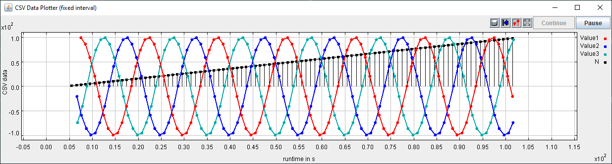
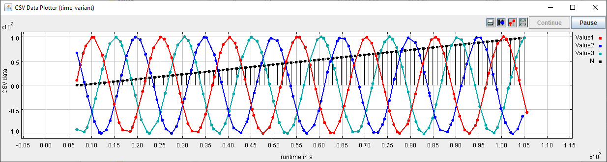

Prerequisites
=============

Required Lablink resources
--------------------------

The following Lablink resources are required:

* `Configuration Server <https://ait-lablink.readthedocs.io/projects/lablink-config-server>`_: *config-0.0.1-jar-with-dependencies.jar*
* `Datapoint Bridge <https://ait-lablink.readthedocs.io/projects/lablink-datapoint-bridge>`_: *dpbridge-0.0.1-jar-with-dependencies.jar*
* `Lablink Plotter <https://ait-lablink.readthedocs.io/projects/lablink-plotter>`_: *plotter-0.0.1-jar-with-dependencies*

When :doc:`building from source <installation>`, the corresponding JAR files will be copied to directory *target/dependency*.

Starting the configuration server
---------------------------------

Start the configuration server by executing script :github_blob:`run_config.cmd <examples/0_config/run_config.cmd>` in subdirectory :github_tree:`examples/0_config`.
This will make the content of database file *test-config.db* available via http://localhost:10101.

.. note:: Once the server is running, you can view the available configurations in a web browser via http://localhost:10101.

.. seealso:: A convenient tool for viewing the content of the database file (and editing it for experimenting with the examples) is `DB Browser for SQLite <https://sqlitebrowser.org/>`_.

MQTT broker
-----------

An **MQTT broker** is required for running the example, for instance `Eclipse Mosquitto <https://mosquitto.org/>`_ or `EMQ <http://emqtt.io/>`_.

Example 1: Fixed interval data source
=====================================

This example reads CSV data from the configuration server (the data can be viewed `here <http://localhost:10101/view?id=ait.test.csvclient.fixed.data>`__ when the configuration server is running locally).
The data from the columns of the CSV source (called *test1.val1*, *test2.val2*, *test3.val3*, *test4.n*) are sent one after the other as individual measurements to a plotter.
The time between two consecutive measurements is constant (set to 1 second in this example).

The CSV data looks like this:

.. code-block::

   test1.val1,test2.val2,test3.val3,test4.n
   0.0,86.6,-86.6,0
   40.7,58.8,-99.5,1
   74.3,20.8,-95.1,2
   95.1,-20.8,-74.3,3
   99.5,-58.8,-40.7,4
   86.6,-86.6,0.0,5
   58.8,-99.5,40.7,6
   ...

When sent to the plotter, the CSV client's output looks like this:

All relevant scripts can be found in subdirectory :github_tree:`examples/1_fixed_interval`.
To run the example, execute all scripts either in separate command prompt windows or by double-clicking:

* :github_blob:`csv-fixed-interval.cmd <examples/1_fixed_interval/csv-fixed-interval.cmd>`: runs the CSV client, which will send data to the plotter
* :github_blob:`dpb.cmd <examples/1_fixed_interval/dpb.cmd>`: runs the data point bridge service, connecting the CSV client and the plotter
* :github_blob:`plot.cmd <examples/1_fixed_interval/plot.cmd>`: runs the plotter, which will plot incoming data to the screen

.. note:: The scripts can be started in arbitrary order.

Example 2: Timed data source
============================

This example reads CSV data from the configuration server (the data can be viewed `here <http://localhost:10101/view?id=ait.test.csvclient.time-variant.data>`__ when the configuration server is running locally).
The data from the CSV source uses a dedicated format (see `here <dispatch-modes.html#timed-data-source>`__), providing data values associated to timestamps, which are sent one-by-one as individual measurements to a plotter.
The timing of the measurements is determined by the associated timestamps.

The CSV data looks like this:

.. code-block::

   Device;Datapoint;Timestamp;Measurement
   test1;val1;1609412400274;11,4
   test1;val1;1609412401735;66,4
   test1;val1;1609412402268;81,3
   test1;val1;1609412403672;99,9
   test1;val1;1609412404090;99,0
   test1;val1;1609412405897;62,2
   test1;val1;1609412406240;50,4
   ...

When sent to the plotter, the CSV client's output looks like this:

.. note:: 
   The plotted results from both examples may look very similar at first glance.
   However, if you take a closer look you will notice that in the 2nd example the measurements are not received at a fixed rate.
   This difference becomes obvious when you run the examples and watch the measurements being plotted in real time.

All relevant scripts can be found in subdirectory :github_tree:`examples/2_time_variant`.
To run the example, execute all scripts either in separate command prompt windows or by double-clicking:

* :github_blob:`csv-time-variant.cmd <examples/2_time_variant/csv-time-variant.cmd>`: runs the CSV client, which will send data to the plotter
* :github_blob:`dpb.cmd <examples/2_time_variant/dpb.cmd>`: runs the data point bridge service, connecting the CSV client and the plotter
* :github_blob:`plot.cmd <examples/2_time_variant/plot.cmd>`: runs the plotter, which will plot incoming data to the screen

.. note:: The scripts can be started in arbitrary order.
