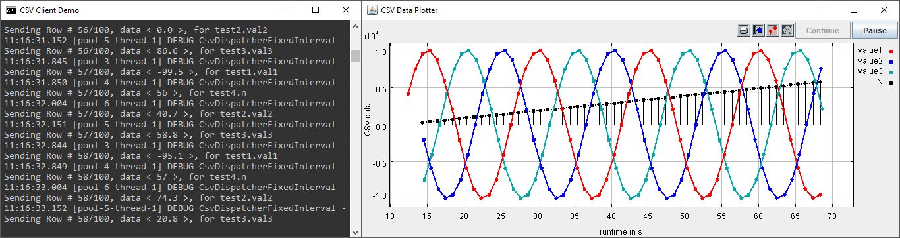

***************************************************************
Documentation for the Lablink CSV client
***************************************************************

.. meta::
   :description lang=en: AIT Lablink CSV client

This package provides a Lablink client that acts as a data source, using data stored in `CSV format <https://commons.apache.org/proper/commons-csv/>`__.
Each data entry from a CSV source will be sent as an individual output (referred to as as "*measurement*").
The CSV client supports two different modes for dispatching CSV data as measurements:

* `Fixed interval data source <dispatch-modes.html#fixed-interval-data-source>`__:
  The data from the columns of the CSV source are sent one after the other as individual measurements.
  The time between two consecutive measurements is constant (but configurable for each CSV column).
  The CSV source itself does not contain any timing information, but only the data values.
* `Timed data source <dispatch-modes.html#timed-data-source>`__:
  The data from the CSV source uses a dedicated format (see `here <dispatch-modes.html#supported-csv-formats-for-timed-data-sources>`__), providing data values associated to timestamps, which are sent one-by-one as individual measurements.
  The timing of the measurements is determined by the timestamps associated to each data value.

   

Installation
============

Find information about the installation of the Lablink CSV client :doc:`here <installation>`.

.. toctree::
   :maxdepth: 2
   :hidden:
   :caption: Installation

   /installation
   
Running the client
==================

Find basic instructions for running the Lablink CSV client :doc:`here <running>`.

.. toctree::
   :maxdepth: 2
   :hidden:
   :caption: Running the clients

   /running

CSV data dispatch modes
=======================

Find information about supported modes for dispatching CSV data :doc:`here <dispatch-modes>`.

.. toctree::
   :maxdepth: 2
   :hidden:
   :caption: CSV data dispatch modes

   /dispatch-modes

Configuration
=============

Find the reference for writing a configuration for a Lablink CSV client :doc:`here <configuration>`.

.. toctree::
   :maxdepth: 2
   :hidden:
   :caption: Configuration

   /configuration

Examples
========

Find step-by-step instructions for running the examples :doc:`here <examples>`.

.. toctree::
   :maxdepth: 2
   :hidden:
   :caption: Examples

   /examples
